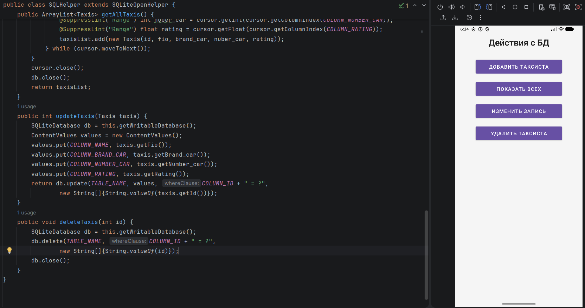
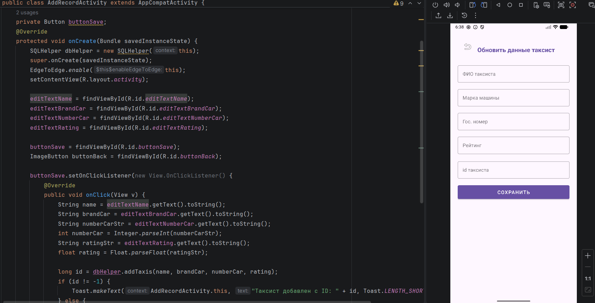
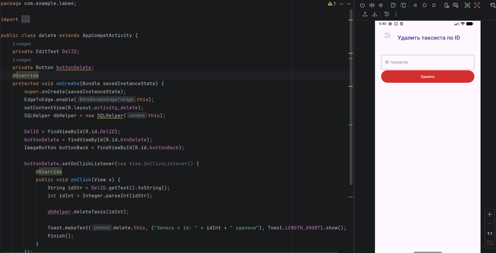

# Отчет

## Практическая работа №4

## Работа с встроенной базой данных SQLite

**Выполнил:**  
Самойлов Павел Олеговчи  
**Курс:** 2  
**Группа:** ИНС-б-о-24-1  
**Направление:** 09.03.02  
**Профиль:** Информационные системы и технологии  

---

### Цель работы

Изучить основы работы с СУБД SQLite в Android-приложениях. Научиться создавать базу данных, таблицы, выполнять основные операции CRUD (Create, Read, Update, Delete) с использованием класса SQLiteOpenHelper и отображать данные на экране.

### Ход работы
## Задание

1. Спроектировать структуру таблицы (минимум 3 поля разных типов, включая первичный ключ _id).

2. Реализовать класс SQLHelper для создания БД и таблицы.

3. Создать модель данных.

4. Реализовать методы add(), getAll(), update(), delete().

5. Разработать простой интерфейс с возможностью:

  - Добавлять новую запись (через диалог или отдельную активность).
  
  - Просматривать список всех записей.
  
  - Удалять запись по нажатию (например, долгое нажатие на элемент списка).
  
  - Обновлять запись.

## Индивидуальное задание

**База таксистов: Водитель (ФИО, марка машины, государственный номер, рейтинг).**

1. Код для создания таблицы в класск SQLHelper с полями: COLUMN_ID, COLUMN_RATING, COLUMN_NUMBER_CAR, COLUMN_BRAND_CAR, COLUMN_NAME

  
    public static final String DATABASE_NAME = "DataBase.db";
    public static final int DATABASE_VERSION = 1;
    public static final String TABLE_NAME = "MyTable";

    public static final String COLUMN_ID = "id";
    public static final String COLUMN_NAME = "fio";
    public static final String COLUMN_BRAND_CAR = "car_brand";
    public static final String COLUMN_NUMBER_CAR = "number_car";
    public static final String COLUMN_RATING = "rating";

    // SQL запрос для создания таблицы
    private static final String CREATE_TABLE =
            "CREATE TABLE " + TABLE_NAME + " (" +
                    COLUMN_ID          + " INTEGER PRIMARY KEY AUTOINCREMENT, " +
                    COLUMN_NAME        + " TEXT NOT NULL, "        +
                    COLUMN_BRAND_CAR   + " TEXT NOT NULL, "              +
                    COLUMN_NUMBER_CAR  + " INTEGER, "              +
                    COLUMN_RATING      + " REAL"                   +
                    ")";

2. Код модели данных для одной записи в БД.
   

  
    public class Taxis {
      private int id;
      private String fio;
      private String brand_car;
      private int number_car;
      private  float rating;
  
      public Taxis(int id, String fio, String brand_car, int nuber_car, float rating) {
          this.id = id;
          this.fio = fio;
          this.brand_car = brand_car;
          this.number_car = nuber_car;
          this.rating = rating;
      }
    }

3. Реализация методов add(), getAll(), update(), delete().

  Реализация метода add()
  
  <code>
    
        public long addTaxis(String fio, String brand_car, int number_car, float rating) {
        SQLiteDatabase db = this.getWritableDatabase();
        ContentValues values = new ContentValues();
        values.put(COLUMN_NAME, fio);
        values.put(COLUMN_BRAND_CAR, brand_car);
        values.put(COLUMN_NUMBER_CAR, number_car);
        values.put(COLUMN_RATING, rating);
        long id = db.insert(TABLE_NAME, null, values);
        db.close();
        return id;
    }
    
  </code>

  Реализация метода getAll()
  
  <code>
    
        public ArrayList<Taxis> getAllTaxis() {
        ArrayList<Taxis> taxisList = new ArrayList<>();
        String selectQuery = "SELECT * FROM " + TABLE_NAME;
        SQLiteDatabase db = this.getReadableDatabase();
        Cursor cursor = db.rawQuery(selectQuery, null);

        if (cursor.moveToFirst()) {
            do {
                @SuppressLint("Range") int id = cursor.getInt(cursor.getColumnIndex(COLUMN_ID));
                @SuppressLint("Range") String fio = cursor.getString(cursor.getColumnIndex(COLUMN_NAME));
                @SuppressLint("Range") String brand_car = cursor.getString(cursor.getColumnIndex(COLUMN_BRAND_CAR));
                @SuppressLint("Range") int nuber_car = cursor.getInt(cursor.getColumnIndex(COLUMN_NUMBER_CAR));
                @SuppressLint("Range") float rating = cursor.getFloat(cursor.getColumnIndex(COLUMN_RATING));
                taxisList.add(new Taxis(id, fio, brand_car, nuber_car, rating));
            } while (cursor.moveToNext());
        }
        cursor.close();
        db.close();
        return taxisList;
    }
  </code>

  Реализация метода update()

  <code>
    
    public int updateTaxis(Taxis taxis) {
      SQLiteDatabase db = this.getWritableDatabase();
      ContentValues values = new ContentValues();
      values.put(COLUMN_NAME, taxis.getFio());
      values.put(COLUMN_BRAND_CAR, taxis.getBrand_car());
      values.put(COLUMN_NUMBER_CAR, taxis.getNumber_car());
      values.put(COLUMN_RATING, taxis.getRating());
      return db.update(TABLE_NAME, values, COLUMN_ID + " = ?",
      new String[]{String.valueOf(taxis.getId())});
    }
        
  </code>

  Реализация метода delete()

  <code>
    
    public void deleteTaxis(int id) {
      SQLiteDatabase db = this.getWritableDatabase();
      db.delete(TABLE_NAME, COLUMN_ID + " = ?",
              new String[]{String.valueOf(id)});
      db.close();
    }
    
  </code>

4. Разработать простой интерфейс с возможностью:

В каждом окне созданы кнопки навигации для взаимодействия с базой данных.

   

*Рисунок 1. Главное окно программы*

*Рисунок 2. Окно добавления записи в БД*

*Рисунок 3. Окно обновления записи в БД*

*Рисунок 4. Окно удаления записи в БД*

### Вывод
В результате выполнения практической работы я изучить основы работы с СУБД SQLite в Android-приложениях. Научился создавать базу данных, таблицы, выполнять основные операции CRUD (Create, Read, Update, Delete) с использованием класса SQLiteOpenHelper и отображать данные на экране.

### Ответы на контрольные вопросы
**Вопрос 1:** Какие типы данных поддерживает SQLite? Как в SQLite можно хранить логические значения и даты?

SQLite поддерживает 5 основных типов хранения (storage classes):

NULL — отсутствие значения

INTEGER — целые числа (от -2^63 до 2^63-1)

REAL — числа с плавающей точкой (double)

TEXT — строки (в кодировке UTF-8, UTF-16 или UTF-16BE)

BLOB — двоичные данные (byte array)

**Вопрос 2:** Для чего нужен класс SQLiteOpenHelper? Опишите назначение методов onCreate() и onUpgrade()
SQLiteOpenHelper — это официальный помощник Android для работы с SQLite. Он:

- Автоматически создаёт базу данных
- Управляет версиями базы
- Закрывает соединения
- Позволяет легко обновлять структуру

onCreate(SQLiteDatabase db) Вызывается только один раз — когда база создаётся впервые.

onUpgrade(SQLiteDatabase db, int oldVersion, int newVersion) Вызывается, когда DATABASE_VERSION в классе увеличился.

**Вопрос 3:** В чем разница между методами getWritableDatabase() и getReadableDatabase()? В каких ситуациях может возникнуть ошибка при вызове getWritableDatabase().

getWritableDatabase() открывает базу на запись (и чтение тоже возможно).

getReadableDatabase() открывает базу только на чтение (быстрее и безопаснее).

Когда getWritableDatabase() бросит исключение:

- Диск заполнен
- Нет прав на запись
- База повреждена
- Недостаточно памяти
- База уже открыта в другом потоке в режиме только для чтения

**Вопрос 4:** Что такое Cursor? Как правильно перемещаться по его элементам и почему важно закрывать его после использования?

Cursor — это указатель на результат запроса. Он представляет собой набор строк из таблицы

Важные методы:

- moveToFirst() — первая строка
- moveToNext() — следующая
- moveToPosition(int) — к конкретной позиции
- getCount() — количество строк
- isAfterLast() — проверка конца

Закрывать Cursor важно так как:
- Освобождает память
- Закрывает файловый дескриптор базы
- Предотвращает утечку памяти (очень частая ошибка!)

**Вопрос 5:** Что такое ContentValues и для каких операций он применяется?

ContentValues — это класс-обёртка, который хранит пары «ключ-значение» для вставки и обновления данных.
Применяется в методах:
- insert()
- update()
- insertOrThrow()
- bulkInsert()

**Вопрос 6:** В чем отличие методов query() и rawQuery()? Приведите пример использования rawQuery() с параметром-плейсхолдером (?).

query()Строит запрос через параметры

rawQuery()Выполняет любой сырой SQL

**Вопрос 7:** Как обработать ситуацию, когда таблица уже существует, но её структура была изменена (например, добавлено новое поле)?

Создаёшь новую таблицу с новой структурой; 
Копируешь данные; 
Удаляешь старую таблицу; 
Переименовываешь новую; 

  <code>
    
    db.execSQL("CREATE TABLE drivers_new (...)");
    db.execSQL("INSERT INTO drivers_new SELECT ... FROM drivers");
    db.execSQL("DROP TABLE drivers");
    db.execSQL("ALTER TABLE drivers_new RENAME TO drivers");
  
  </code>

